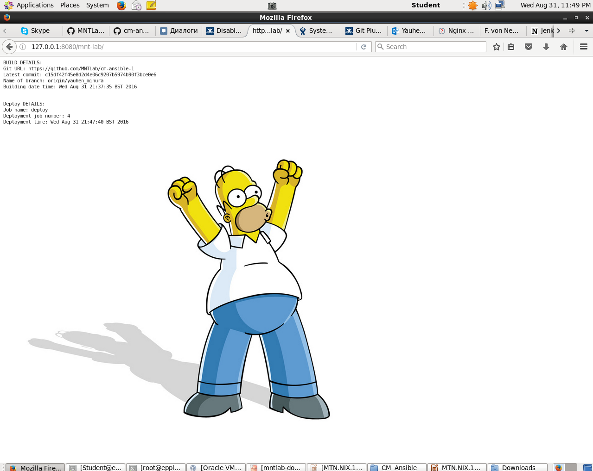
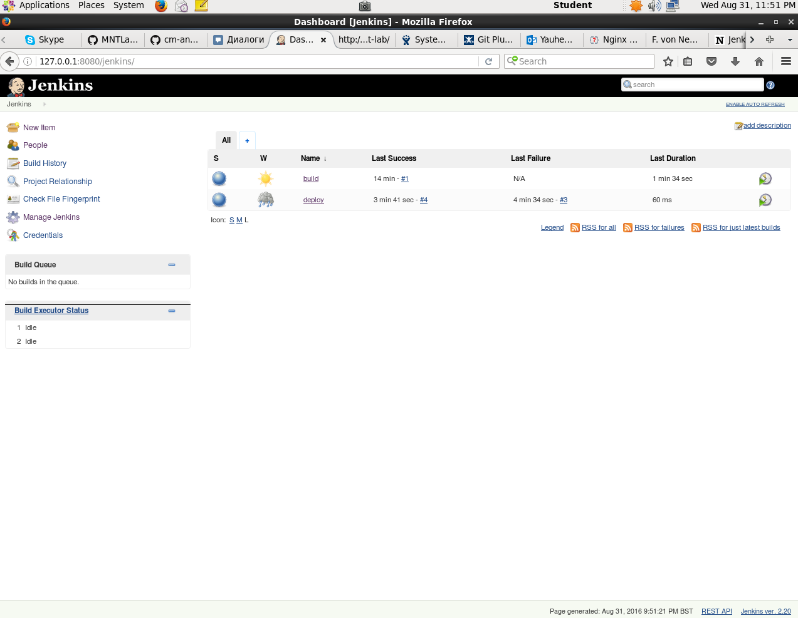
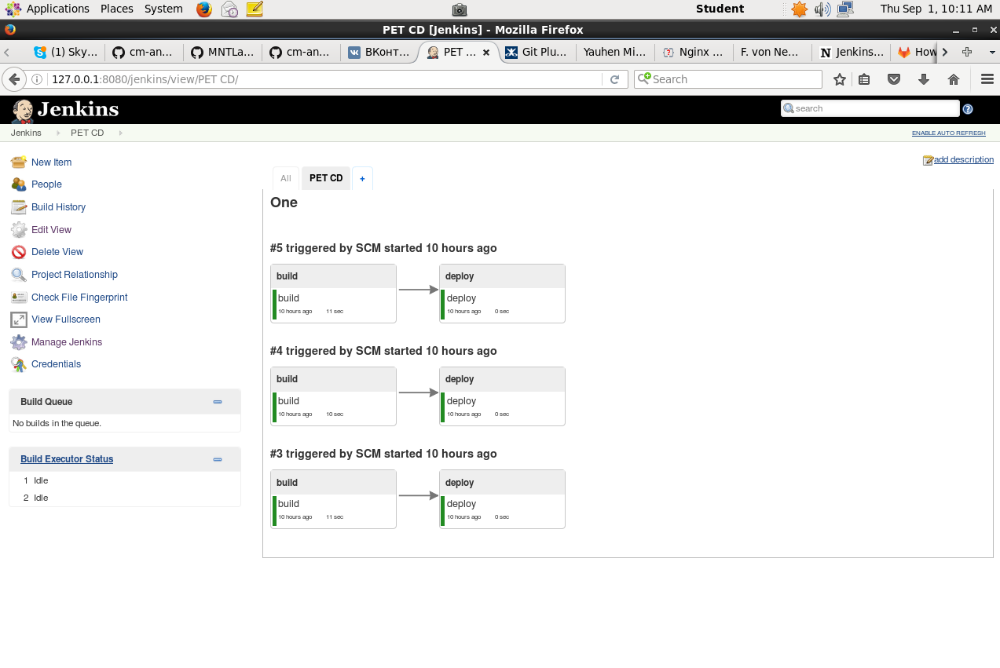
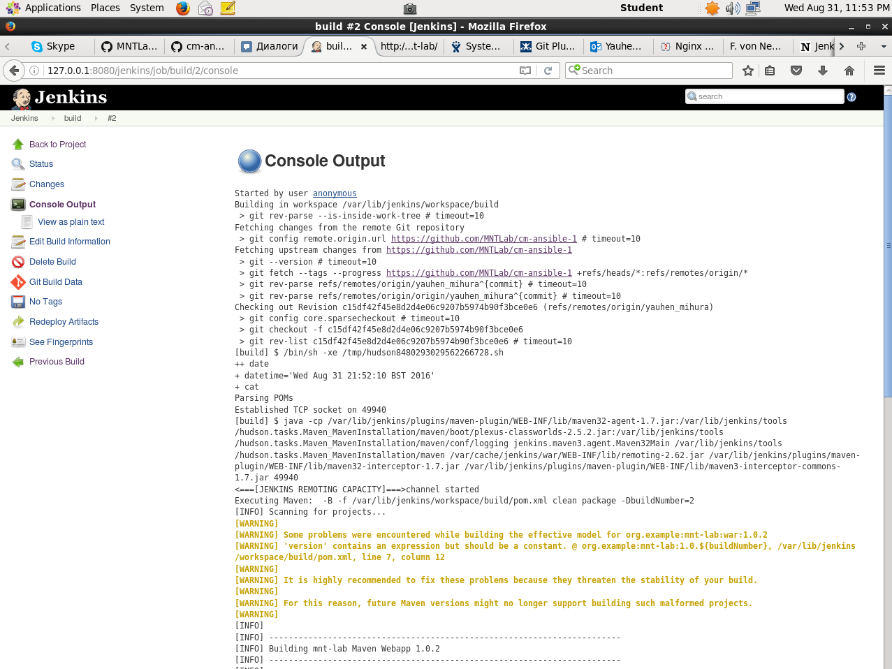
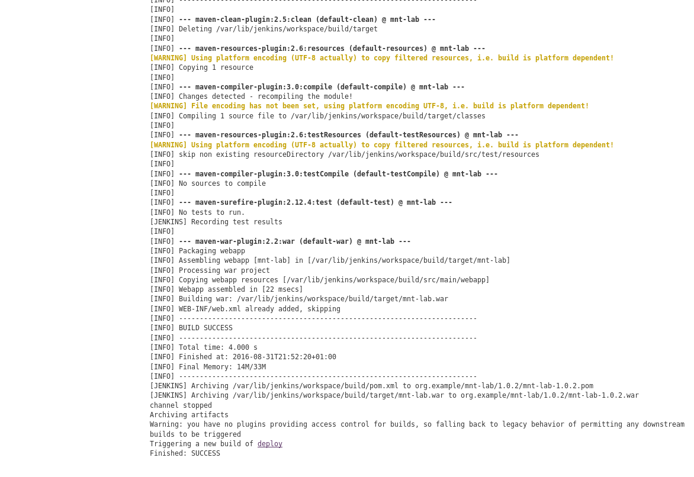
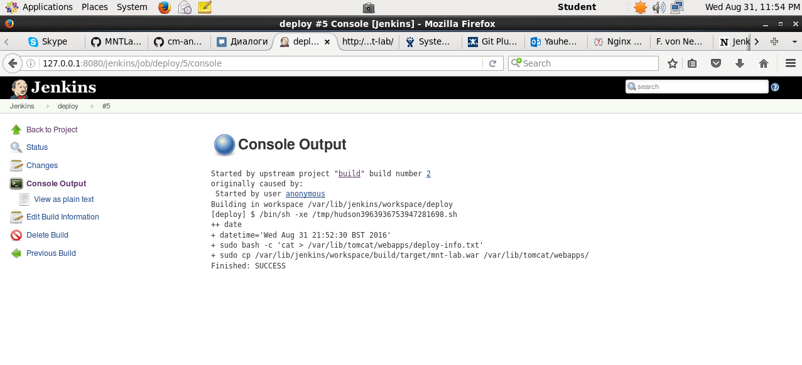

MTN.*NIX.11 Automated Environment Configuration Management
---

***Student***: [Yauhen Mihura](https://upsa.epam.com/workload/employeeView.do?employeeId=4060741400038707325#emplTab=general)

Completed next Home Task

* Created ```Ansible playbook``` ([provision.yml](vagrant/ansible/provision.yml))
* Changed ```Vagrantfile``` ([Vagrantfile](vagrant/Vagrantfile))
* Created job ```build``` ([config.xml](vagrant/ansible/res/jobs/build/config.xml)) 
* Created job ```deploy``` ([config.xml](vagrant/ansible/res/jobs/deploy/config.xml))
* Other configs for services [https://github.com/MNTLab/cm-ansible-1/tree/yauhen_mihura/vagrant/ansible/res]

Result: <br>- [http://localhost:8080/mnt-lab](#yakor)
<br>- [http://localhost:8080/jenkins](#yakor1)
<br>- [Jobs console output](#yakor2)
<br>- [Jobs Pipeline](#yakor3)

<h2><a id="yakor">Deployed application to Tomcat</a></h2>


<h2><a id="yakor1">Jenkins jobs</a></h2>


<h2><a id="yakor3">Jenkins Pipeline</a></h2>


<h2><a id="yakor2">Jobs console output</a></h2>



